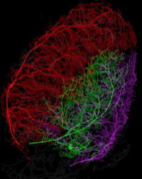

Thin Vessels Segmentation
========================

Modules
---------------

-   **Core**

    Including general data stuctures for 3D volume, data I/O, data visualization, simple 3D image processing and etc. 

-   **Vesselness**

    This is a C++ implementation of Vesselness Measure for 3D volume based on the following paper [Frangi](http://link.springer.com/chapter/10.1007/BFb0056195#page-1). 

    - Frangi, Alejandro F., et al. "Multiscale vessel enhancement filtering." Medical Image Computing and Computer-Assisted Interventation—MICCAI’98. Springer Berlin Heidelberg, 1998. 130-137.

    Two sample code is provided in `main.cpp`:
    
    - Computing vesselness measure
    - Extracting the vessel centrelines with non-maximum suppression

    Sample Usage: 

    - Setting parameters: 
    
      
      [`sigma_from`, `sigma_to`]: the potential size rang of the vessels
      
      `sigma_step`: precision of computation
      
      For other parameters `alpha`, `beta`, `gamma`, please refer to Frangi's papaer or this [blog](http://yzhong.co/?p=351) or Frangi's paper. 

        ```
        float sigma_from = 1.0f;  
        float sigma_to = 8.10f;   
        float sigma_step = 0.5f;  
        float alpha = 1.0e-1f;	
    	float beta  = 5.0e0f;     
        float gamma = 3.5e5f; 
        ```

    - Laoding data

        ```
        Data3D<short> im_short;       
        bool flag = im_short.load( "dataname.data" );         
        if(!flag) return 0;       
        ```
		
    - Compute Vesselness

        ```
        Data3D<Vesselness_Sig> vn_sig;        
        VesselDetector::compute_vesselness( im_short, vn_sig,         
                sigma_from, sigma_to, sigma_step,        
                alpha, beta, gamma );
        ```
	
    - Saving Data

        ```
        vn_sig.save( "dataname.vn_sig" );
        ```

    - If you want to visulize the data using maximum-intensity projection

        ```
        viewer.addObject( vn_sig,  GLViewer::Volumn::MIP );
        viewer.addDiretionObject( vn_sig );
        viewer.go(600, 400, 2);
        ```

-   **ModelFitting (Levenberg Marquardt algorithm)**

    Fitting geometric models (lines) to the 3D vessel data using Levenberg-Marquardt algorithm. 

    Using Levenberg Marquardt algorithm for energy minimization. 

    Energy contains two parts:

    - Data cost
      Distance to the center of a line model
    - Pair-wise smooth cost
      Complicated. Please refer to this [paper](http://www.csd.uwo.ca/~yuri/Abstracts/cvpr12-abs.shtml) for more details

    Levenberg Marquardt algorithm requires to compute the Jacobin matrix for both the data cost and the smooth cost. This computation is very time-consuming and the computation has been highly paralleled in this version. 

-   **SparseMatrix**

    Sparse matrix representation, contains all necessary matrix manipulations such as: 
    
      - addtion
      - subtraction
      - multiplication
      - transpose
   
-   **SparseMatrixCV**

    OpenCV warper for SparseMatrix. For matrix multiplication between sparse matrix and dense matrix. For example, 

    ```
    template <class _Tp, int m, int n>    
    SparseMatrixCV operator*( const cv::Matx<_Tp,m,n>& vec, const SparseMatrixCV& sm );     
    ```
    ```
    Mat_<double> operator*( const SparseMatrixCV& sm, const Mat_<double>& sm );    
    ```

-   **Vesselness-cuda** 

    CUDA version of the vesselness measure (under development)
    
-   **RingsReduction**

    Rings reduction of CT images (under development)
    
-   **EigenDecomp**

    Eigenvalue decomposition of a 3 by 3 symmetric matrix


Requirements
---------------

-  **Linux**

	1. **X Window System** (X11, X, and sometimes informally X-Windows), which is a windowing system for bitmap displays
	
	    ```
	    sudo apt-get install libxmu-dev
	    sudo apt-get install libxi-dev
	    ```
	
	2. **OpenGL**
	
	    `sudo apt-get install mesa-common-dev`

	3. **glew**
	
	    `sudo apt-get install libglew-dev`
	
	4. **freeglut**
	
	    `sudo apt-get install freeglut3-dev`
	
	5. **OpenCV 2.4.9**
	
	    Download [OpenCV](http://opencv.org/). Generate makefile with cmake, build and install the liabrary. 
	
	    ```
	    cmake ./
	    make
	    make install
	    ```
	    One more thing. Make sure you have added the OpenCV lib direcory to PATH by the following.

	    `export LD_LIBRARY_PATH=/usr/local/lib/`

	    `/usr/local/lib` is where the OpenCV libs are located. You could double check by
	    
	    ```
	    pkg-config --libs opencv
	    ```

	6. **Code::Blocks**


-  **Windows**

    All the code was written in C++. So it shouldn't be hard to modify and adapt to Windows. As a matter of fact, earlier version of the development was under Windows. 

----

Some of the results was eventually published in this paper [Thin Structure Estimation with Curvature Regularization](http://www.csd.uwo.ca/~yuri/Papers/iccv15_thin.pdf). Please check it out :) 

<p align="center"> 
	
</p>

 
